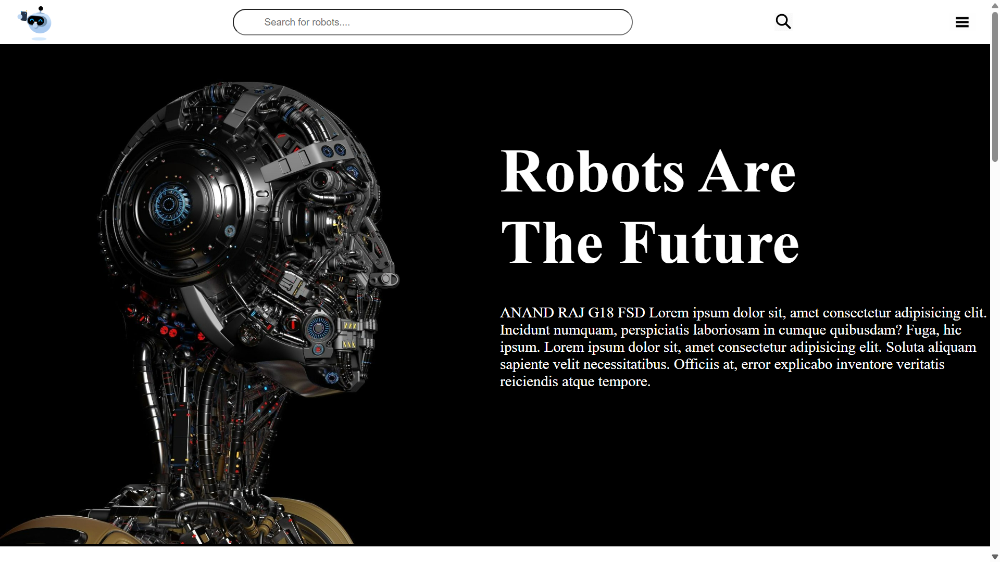
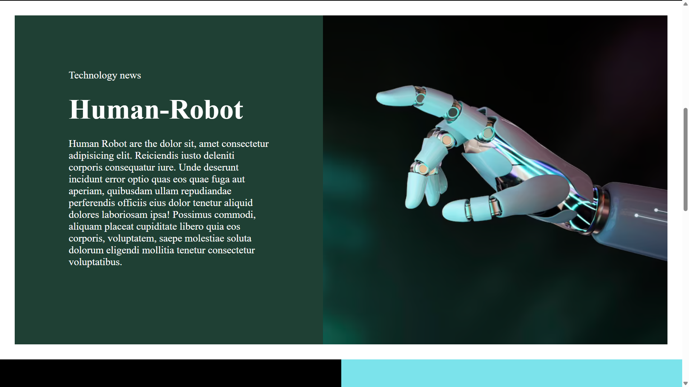
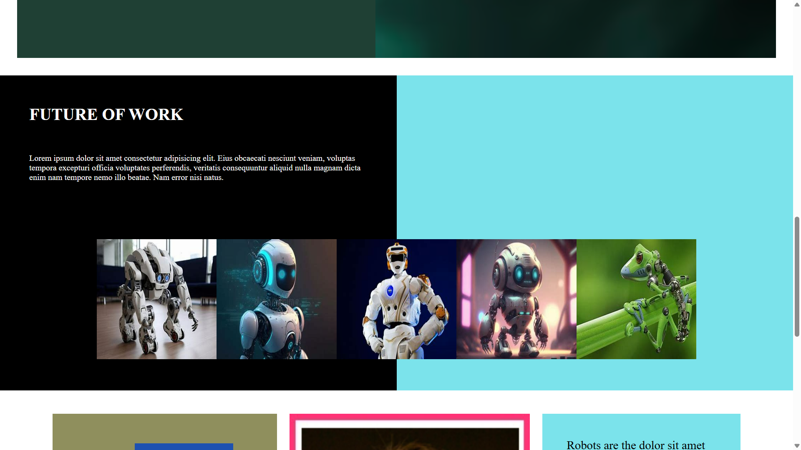
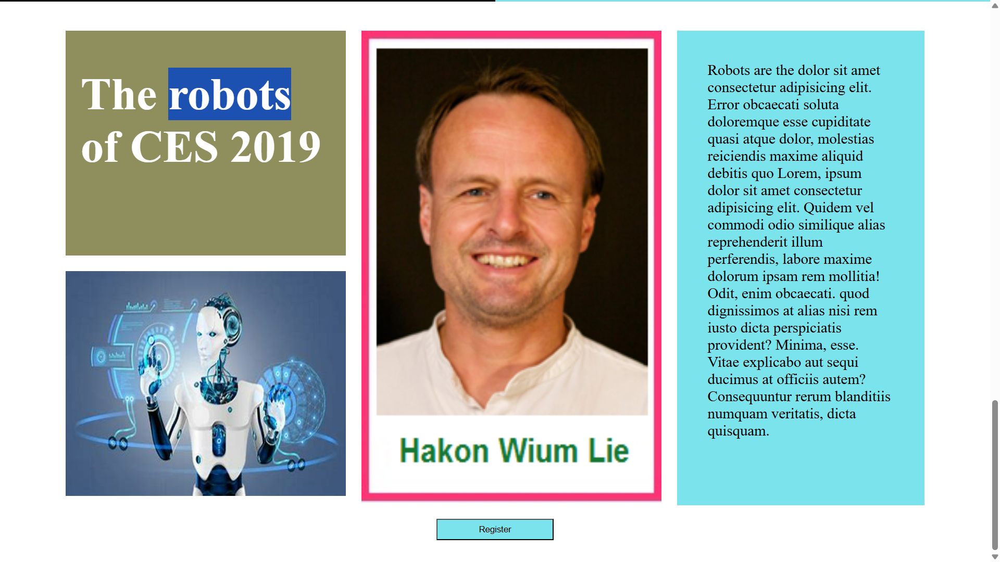

# Robots-are-the-future

Robots-are-the-future is a simple web application built using HTML and CSS. It provides a platform website exploring robotics and technology.

## Overview

Robots-are-the-future" frontend is a dynamic HTML website exploring robotics and technology. Featuring navigation, search, and content sections, it offers insights into futuristic themes, showcasing images and text about the robotics industry.

version 1 is hosted [HERE!](https://anandraj012.github.io/Robots-are-the-future/)


## Getting Started

To run Robots-are-the-future locally, follow these steps:

1. Clone the repository to your local machine.
2. Open the `index.html` file in your web browser.
3. Explore the different sections of Robots-are-the-future.

## Screenshots






<!-- ## License -->
<!-- Robots-are-the-future is licensed under the MIT License. See the [LICENSE](LICENSE) file for more details. -->
### Installation

1. Clone the repository:
   ```sh
   git https://github.com/ANANDRAJ012/Robots-are-the-future.git
   cd Robots-are-the-future

Feel free to explore and build upon this project to create a fully functional Robots-are-the-future application. For any questions or assistance, please don't hesitate to reach out to us. Happy coding and happy shopping!


